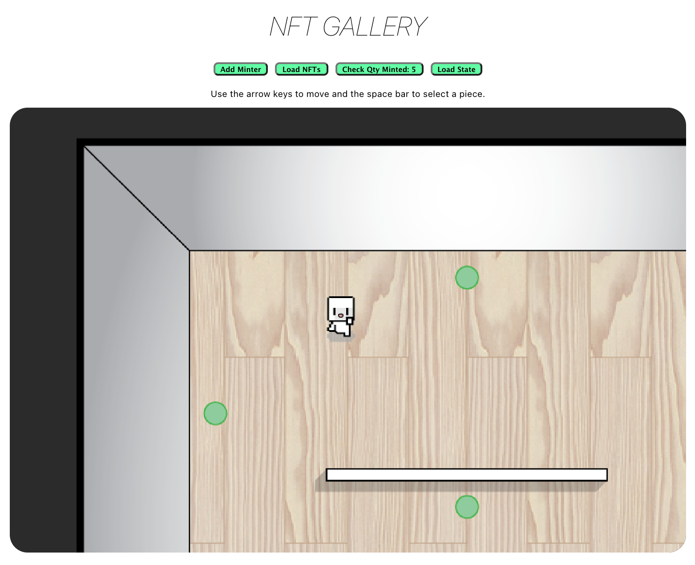
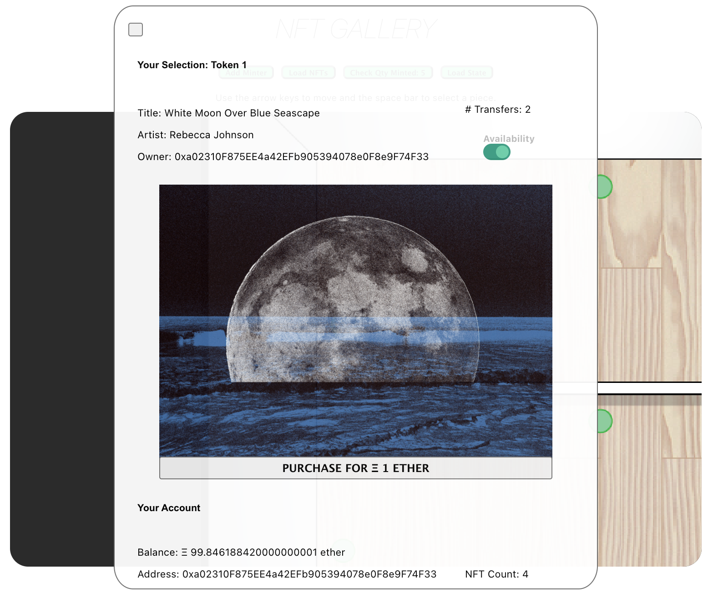

# Blockchain Developer Bootcamp Final Project
### Certification to: qudoki.eth
## NFT Gallery
### Description:
A gamified education platform allowing users to move around a single-player perspective space, connect to their Metamask wallets, mint and purchase NFT's in a visual front-end gallery setting through an ERC-721 token. This encourages traditional artists that may work in digital artforms to tie into the NFT space, with no prerequesite understanding of the blockchain.
#### Usage:
1. User (gallery) will load (mint) all NFTs, check minting, and load to state.
2. User (gallery or buyer) will move around gallery space (arrow keys) and select artwork by pressing space bar.
3. User will view artwork and elect to purchase an NFT.
4. User (buyer) will connect Metamask wallet.
5. User (buyer) will show confirmed ownership of NFT.

## Deployment & Repository
- [Github Repository Link](https://github.com/qudoki/blockchain-developer-bootcamp-final-project)
- [Deployment to Github Pages](https://qudoki.github.io/blockchain-developer-bootcamp-final-project/)
- [Video Walkthrough](https://www.loom.com/share/cd55fc55fb1648b09d6e9918176af1e6)

## Tech
* Solidity >=0.5.16 <0.9.0;
* Truffle v5.4.19 (core: 5.4.19)
* Node v17.3.1
* Web3.js v1.5.3
* Javascript ES6
* React 17.0.2
* Express 4.17.2

## Note to Consensys Graders When Interacting with App
Note that files are preloaded onto IPFS, and addresses are hard-coded to write to the blockchain. In future development, uploading would be made possible for minting, but for now - the NFT's will have been pre-minted. Tokens 3 and 5 will have been purchased by the Rinkeby "Buyer" Account as seen in the walkthrough video, linked above.
1. Please click Check NFT button.
2. Wait a second.
3. Click Load State.
4. Continue to navigation and purchase logic.

## Installing
1. Git clone the repo in a new folder: `git clone https://github.com/qudoki/blockchain-developer-bootcamp-final-project.git`
2. cd into the blockchain-developer-bootcamp-final-project folder
3. run `npm install` for all dependencies

## Testing
Tests were developed to check deployment and functionality. Check that port is set to 8545. You can run tests by:
1. run `ganache-cli` in separate terminal
2. run `truffle migrate`
3. run `truffle test` (all 17 tests will pass)

## Screenshots:

## Contributing:
- Please contact Quinn Dong-Kilkenny (qudoki) for collaboration.

## Questions:
- [Github Profile](https://github.com/qudoki)
- [Email Me](mailto:qudoki.dev@gmail.com)

## License: 
MIT
[License](https://img.shields.io/badge/license-MIT-green")

    Copyright 2021 Quinn Dong-Kilkenny 

    Permission is hereby granted, free of charge, to any person obtaining a copy of this software and associated documentation files (the "Software"), to deal in the Software without restriction, including without limitation the rights to use, copy, modify, merge, publish, distribute, sublicense, and/or sell copies of the Software, and to permit persons to whom the Software is furnished to do so, subject to the following conditions:
    The above copyright notice and this permission notice shall be included in all copies or substantial portions of the Software.
    THE SOFTWARE IS PROVIDED "AS IS", WITHOUT WARRANTY OF ANY KIND, EXPRESS OR IMPLIED, INCLUDING BUT NOT LIMITED TO THE WARRANTIES OF MERCHANTABILITY, FITNESS FOR A PARTICULAR PURPOSE AND NONINFRINGEMENT. IN NO EVENT SHALL THE AUTHORS OR COPYRIGHT HOLDERS BE LIABLE FOR ANY CLAIM, DAMAGES OR OTHER LIABILITY, WHETHER IN AN ACTION OF CONTRACT, TORT OR OTHERWISE, ARISING FROM, OUT OF OR IN CONNECTION WITH THE SOFTWARE OR THE USE OR OTHER DEALINGS IN THE SOFTWARE.